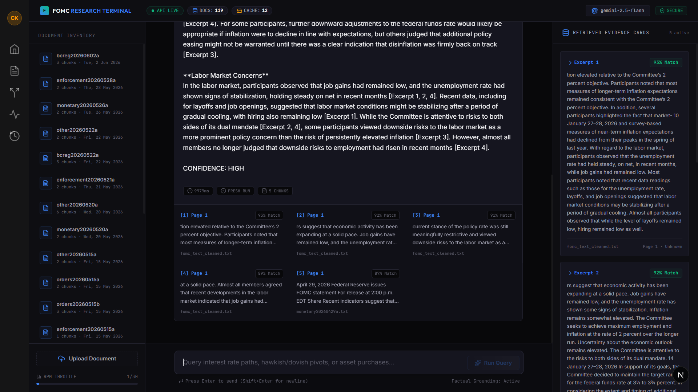
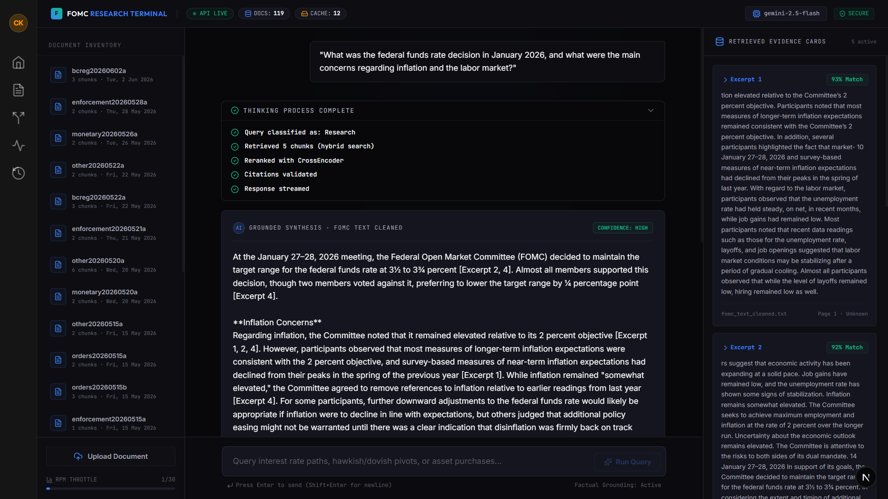
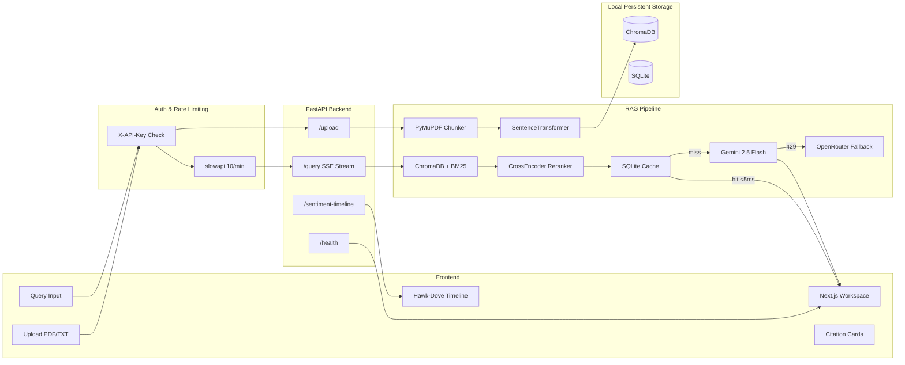

# FOMC AI Analyzer 🏛️

<div align="center">

### Production-ready local intelligence platform for Federal Reserve policy analysis

[](https://github.com/mathworks/MATLAB-Simulink-Challenge-Project-Hub/tree/main/projects/Federal%20Open%20Market%20Committee%20Minutes%20Analysis%20with%20Large%20Language%20Models)
[](LICENSE)
[](https://fastapi.tiangolo.com)
[](https://nextjs.org)
[](https://python.org)

<br>

**⭐ If you find this useful, please star the repo — it really helps! ⭐**

<br>


<br/><br/>


*AI-native workspace featuring the "Thinking Panel" and semantic citations.*

</div>

---

## What This Is

An advanced local RAG (Retrieval-Augmented Generation) workspace designed for professional economists and financial analysts. It ingests Federal Open Market Committee meeting minutes and answers natural language questions about monetary policy — with source citations, confidence scoring, and real-time policy stance visualization.

Built for the **MathWorks Excellence in AI Challenge #258** by [Karan Chhunchha](mailto:karanchhunchha@gmail.com).

```
Upload FOMC Minutes PDF
        ↓
Page-aware chunking + embedding
        ↓
Hybrid vector + BM25 search
        ↓
CrossEncoder reranking
        ↓
Gemini 2.5 Flash synthesis (streamed)
        ↓
Grounded answer with [Excerpt N] citations + CONFIDENCE: HIGH/MEDIUM/LOW
```

---

## Architecture



---

## Features

### RAG Pipeline
| Feature | Implementation |
|---|---|
| Semantic search | `all-MiniLM-L6-v2` embeddings → ChromaDB cosine similarity |
| Keyword search | BM25 (`rank_bm25`) for term-frequency matching |
| Hybrid retrieval | Vector + BM25 score fusion for better coverage |
| Reranking | `cross-encoder/ms-marco-MiniLM-L-6-v2` — non-blocking via `ThreadPoolExecutor` |
| Query rewriting | Maps conversational queries to formal FOMC terminology |
| Response caching | SHA256 query hash → SQLite cache (<5ms repeat queries) |
| Streaming | Server-Sent Events (SSE) — token-by-token via `StreamingResponse` |
| Fallback | Gemini 429 → exponential backoff → OpenRouter Llama 3.3 70B |
| Grounding | System prompt enforces context-only answers + `⚠️ LIMITED EVIDENCE` prefix |
| Confidence | `HIGH` (3+ strong excerpts) / `MEDIUM` (1-2) / `LOW` (sparse) |

### Document Processing
- **PDF + TXT** upload with MIME detection (`python-magic`) and 15MB size limit
- **Page-aware chunking** — preserves page numbers in chunk metadata
- **Meeting date extraction** — auto-parsed from document content
- **Hawkish/Dovish scoring** — keyword frequency model (-1.0 to +1.0 scale)
- **Topic classification** — auto-tags chunks (Inflation, Employment, Interest Rates, etc.)
- **Auto-ingestion** — APScheduler polls Federal Reserve RSS for new minutes

### Multi-Agent Intelligence
Four specialized agents routed by an orchestrator:
- **FOMC Agent** — policy stance tracking, cross-meeting comparison
- **Speech Agent** — Fed speech and testimony analysis, forward guidance extraction
- **News Agent** — press releases and Federal Reserve news analysis
- **Market Agent** — financial market correlation and policy impact assessment

### Production Engineering
| Area | What's in place |
|---|---|
| Auth | `X-API-Key` header verification via FastAPI dependency |
| Rate limiting | `slowapi` — 10/min queries, 5/min uploads, 100/min general |
| CORS | Strict env var whitelist |
| Input validation | HTML strip, null byte removal, 2000 char limit, MIME check |
| Persistence | Local ChromaDB + SQLite data persistence between sessions |
| Timeouts | 25s Gemini timeout via `ThreadPoolExecutor.result(timeout=25)` + 30s frontend `AbortController` |
| Logging | `loguru` structured logs with `X-Request-ID` per request, daily rotation |
| Health check | `GET /health` — indexed doc count, cache entries, uptime, model |

---

## Evaluation Results

Tested on 10 FOMC-specific Q&A pairs using LLM-as-a-judge evaluation (`evaluation/ragas_eval.py`):

| Metric | Score |
|---|---|
| Retrieval Precision @5 | **0.695** |
| Answer Faithfulness | **0.860** |
| Answer Relevancy | **0.860** |
| Context Recall | **0.860** |

> Run your own evaluation: `python evaluation/ragas_eval.py`

---

## MATLAB Analytics Layer

Eight MATLAB scripts demonstrating the MathWorks challenge toolboxes:

| Script | Toolbox | What it does |
|---|---|---|
| `ingest_documents.m` | Text Analytics Toolbox™ | Tokenization, stop word removal, case folding |
| `fomc_sentiment_analysis.m` | Statistics & ML Toolbox™ | Hawk-Dove Index calculation, policy gauge visualization |
| `fomc_rag_pipeline.m` | Deep Learning Toolbox™ | TF-IDF cosine similarity search, LLM REST integration |
| `fomc_retrieval.m` | Text Analytics Toolbox™ | Semantic retrieval demonstration |
| `fomc_validation.m` | Statistics Toolbox™ | Pipeline validation with pass/fail metric charts |
| `fomc_database.m` | Database Toolbox™ | Document storage and retrieval simulation |
| `fomc_downloader.m` | — | Federal Reserve document download automation |
| `matlab/README.md` | — | Setup guide and toolbox requirements |

> **Architecture note:** MATLAB operates as a standalone analytics validation and visualization layer demonstrating Challenge #258 toolbox requirements. The production API is Python-native for cloud deployment portability. No MATLAB runtime is required to run the live system.

---

## Tech Stack

| Layer | Technology |
|---|---|
| Frontend | Next.js 15, React 19, TypeScript, Tailwind CSS |
| Backend | FastAPI, Python 3.11+, Uvicorn |
| LLM | Gemini 2.5 Flash (primary), OpenRouter Llama 3.3 70B (fallback) |
| Embeddings | `sentence-transformers/all-MiniLM-L6-v2` (local) |
| Reranker | `cross-encoder/ms-marco-MiniLM-L-6-v2` (local) |
| Vector DB | ChromaDB (persistent) |
| Database | SQLite (default) / PostgreSQL (optional) |
| PDF | PyMuPDF (`fitz`) |
| Security | SlowAPI, python-magic, loguru |

---

## Project Structure

```
fomc-ai-analyzer/
├── backend/
│   ├── api.py                  # FastAPI app — all endpoints
│   ├── rag_pipeline.py         # Core RAG with SSE streaming
│   ├── semantic_search.py      # ChromaDB + BM25 hybrid search
│   ├── embeddings.py           # Sentence Transformer (singleton)
│   ├── vector_store.py         # ChromaDB collection management
│   ├── database.py             # SQLite / PostgreSQL dual engine
│   ├── document_processor.py   # Page-aware PDF/TXT chunking
│   ├── financial_analyzer.py   # Hawk/Dove sentiment scoring
│   ├── query_rewriter.py       # Formal terminology mapping
│   ├── bm25_search.py          # BM25 keyword search
│   ├── agent_orchestrator.py   # Multi-agent routing
│   ├── fomc_agent.py           # FOMC document analysis agent
│   ├── speech_agent.py         # Fed speech analysis agent
│   ├── news_agent.py           # Federal Reserve news agent
│   ├── market_agent.py         # Market correlation agent
│   ├── ingestion_worker.py     # Auto-ingestion from Fed RSS
│   ├── config.py               # Config + loguru setup
│   ├── auth.py                 # X-API-Key dependency
│   └── dependencies.py         # FastAPI lru_cache singletons
├── frontend/
│   ├── src/app/
│   │   ├── workspace/          # Main query interface
│   │   ├── documents/          # Document manager
│   │   ├── insights/           # Macroeconomic analysis pivots
│   │   ├── compare/            # Cross-meeting comparison
│   │   ├── sessions/           # Chat history
│   │   └── api/                # Secure Next.js backend proxy
│   └── src/components/         # Topbar, Sidebar, ResponseCard, SentimentTimeline
├── matlab/                     # 8 MATLAB analytics scripts
├── data/raw/sample/            # Sample FOMC document for testing
├── evaluation/
│   └── ragas_eval.py           # LLM-as-a-judge evaluation runner
├── render.yaml                 # Render deployment with Disk config
└── .env.example                # All required environment variables
```

---

## API Reference

| Method | Endpoint | Access | Description |
|---|---|---|---|
| `GET` | `/health` | 🌐 Public | System status — doc count, cache, uptime, model |
| `POST` | `/upload` | 🔒 Auth | Upload PDF/TXT — MIME validation, 15MB limit |
| `POST` | `/query` | 🔒 Auth | SSE streaming query with citations |
| `GET` | `/documents` | 🌐 Public | List all indexed documents |
| `DELETE` | `/documents/{id}` | 🔒 Auth | Delete document + vectors |
| `GET` | `/sentiment-timeline` | 🌐 Public | Hawk/Dove scores over time |
| `POST` | `/sessions` | 🔒 Auth | Create chat session |
| `GET` | `/sessions/{id}/history` | 🌐 Public | Get session history |
| `DELETE` | `/sessions/{id}` | 🔒 Auth | Delete session |

**Example query (Local Backend):**
```bash
curl -X POST http://localhost:8000/query \
  -H "Content-Type: application/json" \
  -H "X-API-Key: your_local_api_key" \
  -d '{"query": "What was the inflation outlook at the January 2026 meeting?", "top_k": 5}'
```

---

## Getting Started (Local)

### 1 — Clone & backend setup

```bash
git clone https://github.com/Karanchhunchha/fomc-ai-analyzer.git
cd fomc-ai-analyzer

python -m venv venv
venv\Scripts\activate          # Windows
# source venv/bin/activate     # macOS/Linux

pip install -r requirements.txt
```

### 2 — Configure environment

```bash
cp .env.example .env
```

Minimum required in `.env`:
```env
GEMINI_API_KEY=your_gemini_api_key_here
```

Get a free Gemini key at: https://aistudio.google.com/apikey

> SQLite is the default — no PostgreSQL setup needed.

### 3 — Start backend

```bash
python -m uvicorn backend.api:app --host 0.0.0.0 --port 8000 --reload
```

Verify: `GET http://localhost:8000/health`

### 4 — Start frontend

```bash
cd frontend
npm install
npm run dev
```

Open: `http://localhost:3000`

### 5 — Test it

1. Upload `data/raw/sample/fomc_jan_2026_sample.txt`
2. Ask: *"What was the rate decision in January 2026?"*
3. You should see a grounded answer with `[Excerpt N]` citations and `CONFIDENCE: HIGH`

---

## Advanced Usage & Integration

Built for local execution, the platform can be seamlessly extended for advanced financial research:

### 1. Automated Bulk Ingestion
Use the `ingestion_worker.py` to continuously poll the Federal Reserve RSS feeds. Run it as a background service to ensure your vector store is always up-to-date with the latest minutes.

```bash
python backend/ingestion_worker.py --daemon --interval 3600
```

### 2. Custom Agent Orchestration
You can override or extend the existing intelligence agents (`fomc_agent.py`, `market_agent.py`) to pipe outputs directly into algorithmic trading signals, macroeconomic forecasting models, or internal risk dashboards.

### 3. Programmatic API Integration
Integrate the FastAPI backend directly into your existing data pipelines by querying the RAG pipeline programmatically:

```python
import requests

response = requests.post(
    "http://127.0.0.1:8000/query",
    headers={"X-API-Key": "your_local_api_key"},
    json={
        "query": "Hawkish indicators in the latest minutes", 
        "top_k": 10
    }
)

print(response.json())
```

---

## Optional: Cloud Deployment

While configured for local use, the project includes a `render.yaml` for optional deployment to Render.
- **Backend**: Mount a 1GB Disk to `/var/data` and set `CHROMA_PERSIST_PATH=/var/data/chroma_db`.
- **Frontend**: Can be deployed to Vercel by setting `API_BASE_URL` to your Render URL.

---

## MathWorks Challenge Submission

- **Challenge**: [Federal Open Market Committee Minutes Analysis with LLMs — Project #258](https://github.com/mathworks/MATLAB-Simulink-Challenge-Project-Hub/tree/main/projects/Federal%20Open%20Market%20Committee%20Minutes%20Analysis%20with%20Large%20Language%20Models)
- **Submitted by**: Karan Chhunchha ([karanchhunchha@gmail.com](mailto:karanchhunchha@gmail.com))
- **AI usage**: Documented in [AI_ACKNOWLEDGMENT.md](AI_ACKNOWLEDGMENT.md)
- **License**: [MIT](LICENSE)

---

## Acknowledgments

- [MathWorks](https://www.mathworks.com) — Challenge inspiration and MATLAB toolboxes
- [Federal Reserve](https://www.federalreserve.gov) — Public FOMC meeting minutes
- [Google DeepMind](https://deepmind.google) — Gemini API
- [Hugging Face](https://huggingface.co) — Sentence Transformers, CrossEncoder
- [ChromaDB](https://www.trychroma.com) — Open-source vector database
