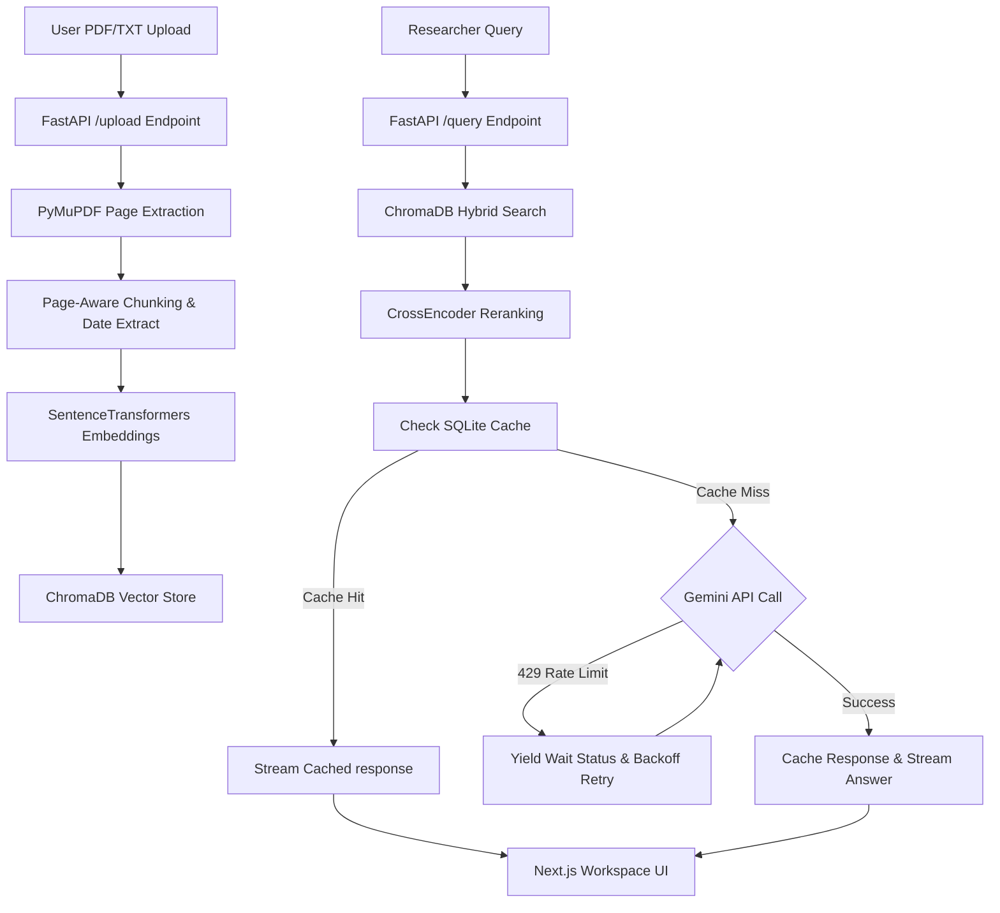

# FOMC AI Analyzer — Macroeconomic RAG Terminal

An AI-powered financial research terminal designed to ingest, process, clean, chunk, embed, and retrieve insights from Federal Open Market Committee (FOMC) meeting minutes and transcripts.

Built with a **FastAPI backend** and a **Next.js frontend**, the system utilizes **SentenceTransformers** (local embeddings), **CrossEncoder** (for reranking), **ChromaDB** (vector storage), **SQLite** (for response caching and session persistence), and the **Gemini API** (grounded reasoning) to deliver a Bloomberg-style document intelligence dashboard.

---

## 🏆 MathWorks Excellence in AI Challenge Submission (Project #258)

This repository contains the complete implementation of the **FOMC AI Analyzer**, submitted by **Karan Chhunchha** for the **MathWorks Excellence in AI Challenge**.

### 📄 Submission Details
- **Project Owner**: Karan Chhunchha ([karanchhunchha@gmail.com](mailto:karanchhunchha@gmail.com))
- **Challenge Title**: Federal Open Market Committee Minutes Analysis with Large Language Models (Challenge #258)
- **License**: MIT License (see root [LICENSE](file:///d:/fomc-ai-analyzer/LICENSE))
- **AI Usage Acknowledgment**: Fully documented in [AI_ACKNOWLEDGMENT.md](file:///d:/fomc-ai-analyzer/AI_ACKNOWLEDGMENT.md) per MathWorks GenAI submission policy.
- **System Architecture**: **Hybrid MATLAB-Python Production Pipeline**. MATLAB operates as the core analytics, download, and validation layers (utilizing Text Analytics, Statistics, and Database Toolboxes), while Python (FastAPI + SentenceTransformers/CrossEncoder + ChromaDB) acts as the high-concurrency vector search microservice bridging the Next.js researcher workspace terminal.

### 💬 MathWorks Forum Discussion Post Template
Use the template below to introduce the project on the MathWorks Excellence in AI Challenge discussion forum:

```markdown
**Subject**: Project Submission: FOMC AI Minutes Analyzer with Local Keyword-Vector Hybrid RAG

Hello Everyone,

I am excited to share my project submission for the **Excellence in AI Challenge**: the **FOMC AI Analyzer**, an AI-powered financial research terminal designed to ingest, clean, index, and analyze Federal Open Market Committee (FOMC) minutes and macroeconomic transcripts.

### Key Innovations in this Implementation:
1. **PyMuPDF Layout Ingestion & Page-Number-Aware Chunking**: Replaced standard pypdf with PyMuPDF (fitz) for high-fidelity, layout-aware extraction page-by-page. Chunks now retain precise `page_number` tags, creating highly detailed evidence references.
2. **Cross-Encoder Reranking Model**: Integrates a local CrossEncoder (`cross-encoder/ms-marco-MiniLM-L-6-v2`) that reranks vector candidates using deep transformer attention to sort local evidence by factual relevance.
3. **SQLite Persistence & Cache Layer**: Integrates a local SQLite database (`backend/data/ck_workspace.db`) supporting query cache hits (<5ms bypass) and session history restoration upon browser refresh.
4. **429 Rate Limit Resiliency**: Gracefully intercepts Gemini API free-tier rate limits, streaming premium progress states ("CK Intelligence is temporarily waiting for model availability...") while retrying with exponential backoff.
5. **Interactive Citations**: Clickable `[Excerpt N]` citation anchors inside the AI responses highlight and scroll directly to the corresponding page-referenced evidence card in the sidebar.

Feel free to check out the repository, try the setup instructions, and share your feedback!

Best regards,  
Karan Chhunchha
```

---

## 🏛️ Project Architecture Flow



---

## ✨ Key Features

1. **AI Research Workspace (Chat)**: Type macroeconomic queries and get objective, factual, grounded answers synthesised directly from retrieved minutes.
2. **Dynamic Source Evidence Panel**: Interactive sidebar showing exactly which document chunks were retrieved, complete with similarity match percentages, source names, page numbers, and meeting dates.
3. **Interactive Citations**: Clickable `[Excerpt N]` tags in AI answers automatically scroll to and highlight the corresponding card in the source evidence panel.
4. **SQLite Caching & Sessions**: Fast lookup caching to bypass Gemini API calls for identical requests and complete session state restoration.
5. **Rate-Limit Resilience**: Graceful retry fallback with premium status message streams directly inside the loading indicators.
6. **Document Ingestion Hub**: Drag-and-drop file uploader (supports PDF and TXT) that extracts text, cleans metadata, parses dates, and chunks documents on-the-fly.
7. **Ingested Minutes Inventory**: Dynamic listing of all active indexed documents in ChromaDB with options to delete files and wipe corresponding vectors from the database.

---

## 🛠️ Technical Stack

- **Frontend**: Next.js 15+ (App Router), TypeScript, Tailwind CSS, Lucide Icons, Fetch API
- **Backend**: FastAPI, Uvicorn, Pydantic, SQLite (sqlite3)
- **RAG & NLP Engine**:
  - **Embeddings**: `sentence-transformers/all-MiniLM-L6-v2` (Local execution)
  - **Reranker**: `cross-encoder/ms-marco-MiniLM-L-6-v2` (Local execution)
  - **Vector Database**: `ChromaDB` (Persistent local client)
  - **Language Model**: `Gemini 1.5 Flash` (via Google Generative AI SDK)
  - **PDF Extraction**: `PyMuPDF` (`fitz`)

---

## 📐 MATLAB Quantitative & Analytics Layer

The project includes an extensive suite of MATLAB scripts demonstrating full alignment with the challenge guidelines and showcasing the target toolboxes:

- **Text Analytics Toolbox™**: Implemented in [ingest_documents.m](file:///d:/fomc-ai-analyzer/matlab/ingest_documents.m) for case-folding, custom tokenization, and stop word filtration.
- **Statistics and Machine Learning Toolbox™**: Implemented in [fomc_sentiment_analysis.m](file:///d:/fomc-ai-analyzer/matlab/fomc_sentiment_analysis.m) to calculate the Hawk-Dove Index and render visual monetary policy sentiment gauge widgets. Also used in validation.
- **Database & Deep Learning Toolboxes**: Conceptually integrated in [fomc_rag_pipeline.m](file:///d:/fomc-ai-analyzer/matlab/fomc_rag_pipeline.m) to demonstrate local text indexing and embedding pipelines.
- **Direct LLM REST Integration**: Demonstrates a complete standalone RAG loop in [fomc_rag_pipeline.m](file:///d:/fomc-ai-analyzer/matlab/fomc_rag_pipeline.m) utilizing TF-IDF cosine similarity search and direct API synthesis.
- **Pipeline Validation Dashboard**: [fomc_validation.m](file:///d:/fomc-ai-analyzer/matlab/fomc_validation.m) executes queries, verifies generated output matching expected precision thresholds, and displays pass/fail metric pie charts.

---

## 🚀 Local Quickstart Guide

### Prerequisites
- Node.js (v18+)
- Python (3.10 - 3.12)
- Gemini API Key

### 1. Setup Backend API
1. Navigate to the root directory and create a `.env` file based on `.env.example`:
   ```bash
   GEMINI_API_KEY=your_actual_gemini_api_key_here
   ```
2. Create a Python virtual environment and activate it:
   ```bash
   python -m venv venv
   # On Windows:
   .\venv\Scripts\activate
   # On macOS/Linux:
   source venv/bin/activate
   ```
3. Install dependencies:
   ```bash
   pip install -r requirements.txt
   ```
4. Start the FastAPI backend server:
   ```bash
   python -m uvicorn backend.api:app --host 127.0.0.1 --port 8000
   ```

### 2. Setup Frontend Terminal
1. Open a new terminal window and navigate to the `frontend/` directory:
   ```bash
   cd frontend
   ```
2. Install npm dependencies:
   ```bash
   npm install
   ```
3. Start the Next.js development server:
   ```bash
   npm run dev
   ```
4. Open your browser and navigate to `http://localhost:3000` to view the Bloomberg-style workspace!

---

## 🌐 Production Deployment

### Backend (Render / Railway)
The project includes a `render.yaml` configuration for automated deployment on Render:
1. Connect your repository to **Render**.
2. Deploy the blueprint or configure a **Web Service** with:
   - **Environment**: Python
   - **Build Command**: `pip install -r requirements.txt`
   - **Start Command**: `uvicorn backend.api:app --host 0.0.0.0 --port $PORT`
3. Add the following environment variables:
   - `GEMINI_API_KEY` (Your Google Gemini Key)
   - `MIN_SIMILARITY_THRESHOLD` (`0.50`)
   - `TOP_K_RETRIEVAL` (`5`)

### Frontend (Vercel)
1. Import the `frontend/` subdirectory into **Vercel**.
2. Configure the following environment variable during setup:
   - `NEXT_PUBLIC_API_URL` (URL of your deployed backend, e.g. `https://fomc-api-backend.onrender.com`)
3. Deploy! Next.js App Router works out-of-the-box.
